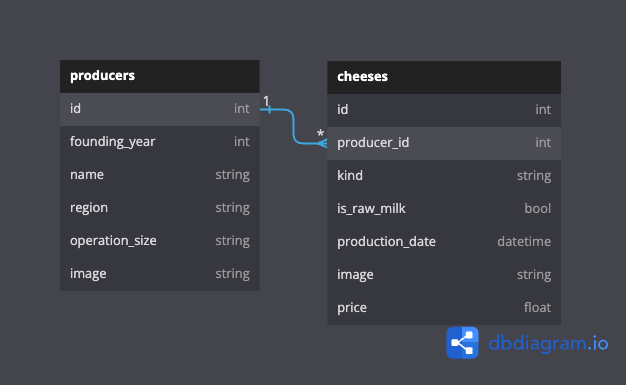

# Practice Challenge - Cheesemakers

Congratulations! You have been hired by the American Fromger Association and for your first job, you
have been tasked with building out a website to log cheesemakers with their
cheeses.

In this repo, there is a Flask application with some features built out. There
is also a fully built React frontend application, so you can test if your API is
working (don't be afraid to use an API clients (such as Postman, Insomnia, Thunder Client) as well).

Your job is to build out the Flask API to add the functionality described in the
deliverables below.

This project is separated into two applications:

- A React frontend, in the `client` directory.
- A Flask backend, in the `server` directory.

All of the features for the React frontend are built out, so you do not need to make any changes there.

---

## Frontend Setup

Let's take a quick tour of what we have so far.

To get started, `cd` into the `client` directory. Then run:

```console
$ npm install
$ npm start
```

Then visit [http://localhost:4000](http://localhost:4000) in the browser to get a sense of the application.

You are not being assessed on React, and you don't have to update any of the React
code; the frontend code is available just so that you can test out the behavior
of your API in a realistic setting.

---

## Backend Setup

In another terminal, run `pipenv install; pipenv shell` to install the
dependencies and enter your virtual environment, then `cd` into the `server`
directory to start running your Python code.

In this directory, you're given a bare-bones template for a Flask API
application. It should look familiar to other Flask labs you've seen and has
all the code set up so you can focus on building out your model and API routes (unless you would prefer to include flask-restful).

You'll be responsible for:

- Creating the models and migrations.
- Setting up the necessary routes to handle requests.
- Performing CRUD actions and validations with SQLAlchemy.
- Sending the necessary JSON data in the responses.

## Instructions

You can run your Flask server from the
`server/` directory with:

```console
$ export FLASK_APP=app.py
$ export FLASK_RUN_PORT=5555
$ flask run
```
OR

```console
$ python app.py
```

## If you would prefer to include Flask Restful complete the following otherwise skip to Models section

This application is using vanilla Flask. If you would like to use flask-restful you can. To setup Flask-restful complete the following steps:

- in the main install flask-restful:

```console
$ pipenv install flask-restful
```

- in the `app.py` file import Api and Resource from flask-restful

```python
from flask_restful import Api, Resource
```

- connect flask-restful to you app

```python
api = Api(app)
```

- remove the routes index route currently setup in `app.py`
- create classes that inherit `Resource` (imported from flask-restful)
- add resources to your api

### Models

You need to create the following relationship:

- A `Producer` has many `Cheeses`
- A `Cheese` belongs to a `Producer`

Start by creating the models and migrations for the following database tables:



## Validations

Add validations to the `Producer` model:

- must have a `name`
- `founding_year` must be 1900 to present
- `operation_size` must be one of "small", "medium", "large", "family", "corporate"

Add validations to the `Cheese` model:

- `production_date` must be before today
- `price` must be between 1.00 and 45.00

After creating the model and migrations, run the migrations and use the provided
`seed.py` file to seed the database:

```console
$ flask db migrate -m'your message'
$ flask db upgrade
$ python seed.py
```

If you run into errors with the migrate or upgrade try:

- deleting the migrations folder and the database
- run the following command to restart the db setup

```console
$ flask db init
```

- try the migrate and upgrade commands again

### Routes

Set up the following routes. Make sure to return JSON data in the format
specified along with the appropriate HTTP verb.

### GET /producers
Return JSON data in the format below. **Note**: you should return a JSON
response in this format, without any additional nested data related to each
cheese.
```json
[
  {
    "founding_year": 1972,
    "id": 1,
    "image": "https://placekitten.com/35/989",
    "name": "Hill, Hunter and West",
    "operation_size": "small",
    "region": "Iowa"
  },
  {
    "founding_year": 1979,
    "id": 2,
    "image": "https://dummyimage.com/685x303",
    "name": "Austin, Bennett and Herrera",
    "operation_size": "family",
    "region": "Pennsylvania"
  }
]
```

### GET /producers/:id
If the `Producer` exists, return JSON data in the format below. **Note**: you will
need to serialize the data for this response differently than for the
`GET /producers` route. Make sure to include an array of cheeses for each
producer.
```json
{
  "cheeses": [
    {
      "id": 4,
      "image": "https://images.pexels.com/photos/773253/pexels-photo-773253.jpeg?auto=compress&cs=tinysrgb&w=1600",
      "is_raw_milk": false,
      "kind": "camembert",
      "price": 21.71,
      "producer_id": 1,
      "production_date": "2019-12-19 00:00:00"
    },
    {
      "id": 11,
      "image": "https://images.pexels.com/photos/4198018/pexels-photo-4198018.jpeg?auto=compress&cs=tinysrgb&w=1600",
      "is_raw_milk": false,
      "kind": "manchego",
      "price": 6.97,
      "producer_id": 1,
      "production_date": "2021-05-23 00:00:00"
    }
  ],
  "founding_year": 1972,
  "id": 1,
  "image": "https://placekitten.com/35/989",
  "name": "Hill, Hunter and West",
  "operation_size": "small",
  "region": "Iowa"
}
```

### DELETE /producers/:id
If the `Producer` exists, it should be removed from the database, along with
any `Cheese`s that are associated with it (a `Cheese` belongs
to an `Producer`, so you need to delete the `Cheese`s before the
`Producer` can be deleted).

After deleting the `Producer`, return an _empty_ response body, along with the
appropriate HTTP status code.

If the `Producer` does not exist, return the following JSON data, along with
the appropriate HTTP status code:

```json
{
  "error": "Producer not found"
}
```
### POST /cheeses

### PATCH /cheeses/:id

### DELETE /cheeses/:id

